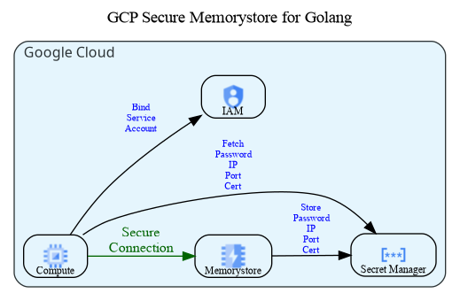

# GCP-Secure-Memorystore-Golang

Example for connecting to GCP Memorystore using Golang.



## Terraform

```
export GOOGLE_APPLICATION_CREDENTIALS=<PATH_TO_JSON_FILE>
export TF_VAR_gcp_project_id=<PROJECT_ID>
export TF_VAR_gcp_region=<REGION>
```

```bash
terraform init
terraform apply
```

## On the instance

Run the instance ssh command from the terraform output.
It will look like

```
gcloud compute ssh --zone <ZONE> vm-<STRING> --project <PROJECT_ID>
```

```bash
git clone https://github.com/maguec/GCP-Secure-Memorystore-Golang
cd GCP-Secure-Memorystore-Golang/
go run secure-pool-example.go
```

To confirm the actual value is getting set correctly

Copy the vm_secret command from the terraform output.
It will look like

```
gcloud secrets versions access latest --secret=memorystore-<STRING>
```

and run the following on the VM

```bash
export MEMORYSTORE_PASS=`gcloud secrets versions access latest --secret=memorystore-<STRING>`
redis-cli --tls --cacert /tmp/ca.crt -h $MEMORYSTORE_IP -p $MEMORYSTORE_PORT -a $MEMORYSTORE_PASS
```

Then the GET KEY command  should work

```bash
XX.XX.XX.XX:XXXX> get key
"value"
```


