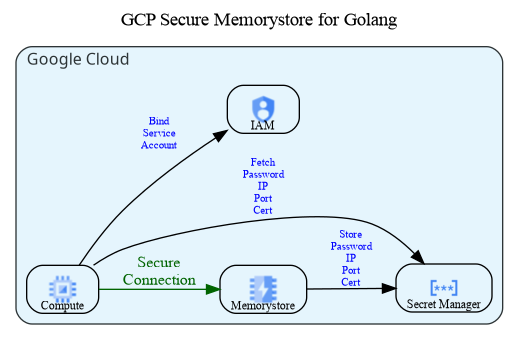

# GCP-Secure-Memorystore-Golang

Example for connecting to GCP Memorystore using Golang using IAM authenticaion and TLS certificates

The terraform stores the following settings in [Secret Manager](https://cloud.google.com/secret-manager/docs)

| Setting |
| --- |
| IP Address |
| Port |
| TLS Certificate |

The previous version of this called the backend API to obtain the server information.

This has been changed for the following reasons

- Access to the backed API should be restricted more tightly
- Calls to the backend API are rate limited with a hard limit so larger deployments may hit this issue




## Terraform

```
export GOOGLE_APPLICATION_CREDENTIALS=<PATH_TO_JSON_FILE>
export TF_VAR_gcp_project_id=<PROJECT_ID>
export TF_VAR_gcp_region=<REGION>
```

```bash
terraform init
terraform apply
```

## On the instance

Run the instance ssh command from the terraform output.
It will look like

```
gcloud compute ssh --zone <ZONE> vm-<STRING> --project <PROJECT_ID>
```

```bash
source /etc/bash.bashrc
git clone https://github.com/maguec/GCP-Secure-Memorystore-Golang
cd GCP-Secure-Memorystore-Golang/
git checkout valkey
export TOKEN=$(gcloud auth print-access-token)
go run secure-pool-example.go --project <PROJECT> --instance ${MEMORYSTORE_INSTANCE}
```

To confirm the actual value is getting set correctly

Copy the vm_secret command from the terraform output.
It will look like

```
gcloud secrets versions access latest --secret=memorystore-<STRING>
```

and run the following on the VM

```bash
source /etc/bash.bashrc
valkey-cli -c --tls --cacert /tmp/ca.crt -h $MEMORYSTORE_IP -p $MEMORYSTORE_PORT -a $TOKEN
```

Then the GET KEY command  should work

```bash
XX.XX.XX.XX:XXXX> get key
"val"
```


